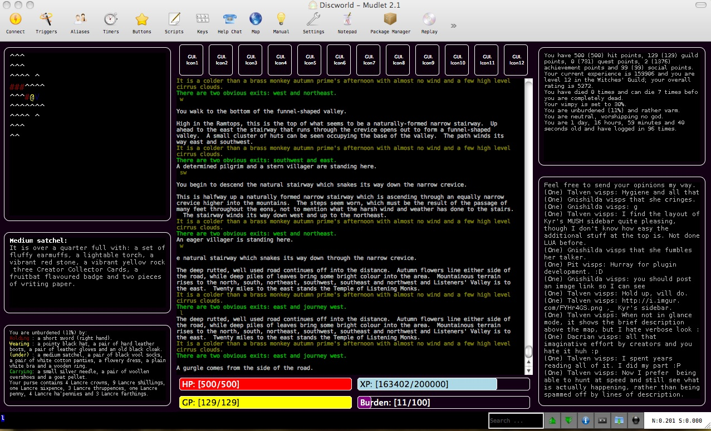

# Gnishilda's Custom Discworld UI

This is an old XML template I made for use with Mudlet 2.1 back in 2014. It's quite broken now, but who doesn't love a good fix-er-upper? Bits of it still work *okay* with current Mudlet 4.12.0. If anyone feels like tinkering around with it, please feel free.

See [the original readme](./README.txt) for installation steps.

Licensed under the [Hippocratic License 2.1](https://firstdonoharm.dev/).

Here's an old screenshot of the GUI back when it worked smoothly.

# Known issues

These popped up sometime between 2014-2020, for whatever that's worth.

* Text boxes don't scale well with window size
* Map box overflows its container
* Entering buildings in the Discworld MUD breaks everything lol.
